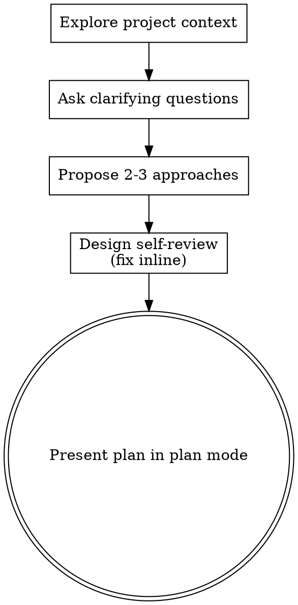

# Brainstorming Ideas Into Designs

Help turn ideas into fully formed designs through natural collaborative dialogue.

Start by understanding the current project context, then ask clarifying questions to refine the idea. Once you understand what you're building, enter plan mode and present a plan based on the design.

<HARD-GATE>
Do NOT write any code, scaffold any project, or take any implementation action within this skill. The skill's terminal action is presenting a plan in plan mode; implementation begins only after the user approves that plan. This applies to EVERY project regardless of perceived simplicity.
</HARD-GATE>

## Anti-Pattern: "This Is Too Simple To Need A Design"

Every project goes through this process. A todo list, a single-function utility, a config change — all of them. "Simple" projects are where unexamined assumptions cause the most wasted work. The plan can be short (a few sentences for truly simple projects), but you MUST present it through plan mode.

## Checklist

You MUST create a task for each of these items and complete them in order:

1. **Explore project context** — check files, docs, recent commits
2. **Ask clarifying questions** — batch independent questions, never dependent ones; understand purpose/constraints/success criteria
3. **Propose 2-3 approaches** — with trade-offs and your recommendation
4. **Design self-review** — quick inline check for placeholders, contradictions, ambiguity, scope (see below)
5. **Present the plan** — enter plan mode and present a plan based on the agreed design

## Process Flow

**The terminal state is presenting the plan in plan mode.** Do NOT implement anything within this skill; implementation starts only after the user approves the plan.

## The Process

**Understanding the idea:**

- Check out the current project state first (files, docs, recent commits)
- Before asking detailed questions, assess scope: if the request describes multiple independent subsystems (e.g., "build a platform with chat, file storage, billing, and analytics"), flag this immediately. Don't spend questions refining details of a project that needs to be decomposed first.
- If the project is too large for a single design, help the user decompose into sub-projects: what are the independent pieces, how do they relate, what order should they be built? Then brainstorm the first sub-project through the normal design flow. Each sub-project gets its own design cycle.
- For appropriately-scoped projects, ask clarifying questions to refine the idea
- Prefer multiple choice questions when possible, but open-ended is fine too
- Batch independent questions into a single message. Never batch dependent questions: if a question's meaning or relevance depends on the answer to another (an answer to question 1 could make question 2 nonsensical), ask them sequentially in separate messages.
- Focus on understanding: purpose, constraints, success criteria

**Exploring approaches:**

- Propose 2-3 different approaches with trade-offs
- Present options conversationally with your recommendation and reasoning
- Lead with your recommended option and explain why

**Design for isolation and clarity:**

- Break the system into smaller units that each have one clear purpose, communicate through well-defined interfaces, and can be understood and tested independently
- For each unit, you should be able to answer: what does it do, how do you use it, and what does it depend on?
- Can someone understand what a unit does without reading its internals? Can you change the internals without breaking consumers? If not, the boundaries need work.
- Smaller, well-bounded units are also easier for you to work with - you reason better about code you can hold in context at once, and your edits are more reliable when files are focused. When a file grows large, that's often a signal that it's doing too much.

**Working in existing codebases:**

- Explore the current structure before proposing changes. Follow existing patterns.
- Where existing code has problems that affect the work (e.g., a file that's grown too large, unclear boundaries, tangled responsibilities), include targeted improvements as part of the design - the way a good developer improves code they're working in.
- Don't propose unrelated refactoring. Stay focused on what serves the current goal.

## Design Self-Review

Before writing the plan, look at the design you've formed with fresh eyes:

1. **Placeholder scan:** Any "TBD", "TODO", incomplete parts, or vague requirements? Fix them.
2. **Internal consistency:** Does any part of the design contradict another? Does the architecture match the feature descriptions?
3. **Scope check:** Is this focused enough for a single implementation, or does it need decomposition?
4. **Ambiguity check:** Could any requirement be interpreted two different ways? If so, pick one and make it explicit.

Fix any issues inline. No need to re-review — just fix and move on.

## Presenting the Plan

- Enter plan mode (skip EnterPlanMode if plan mode is already active) and present the plan via ExitPlanMode
- The plan carries the whole design — architecture, components, data flow, error handling, testing — and the decisions made along the way, scaled to complexity: a few sentences if straightforward, more if nuanced
- Approval is plan mode's approval; do not run a separate design-approval round in the conversation

## Key Principles

- **Batch independent questions** - Ask independent questions together; never batch questions where one depends on another's answer
- **Multiple choice preferred** - Easier to answer than open-ended when possible
- **YAGNI ruthlessly** - Remove unnecessary features from all designs
- **Explore alternatives** - Always propose 2-3 approaches before settling
- **Be flexible** - Go back and clarify when something doesn't make sense
